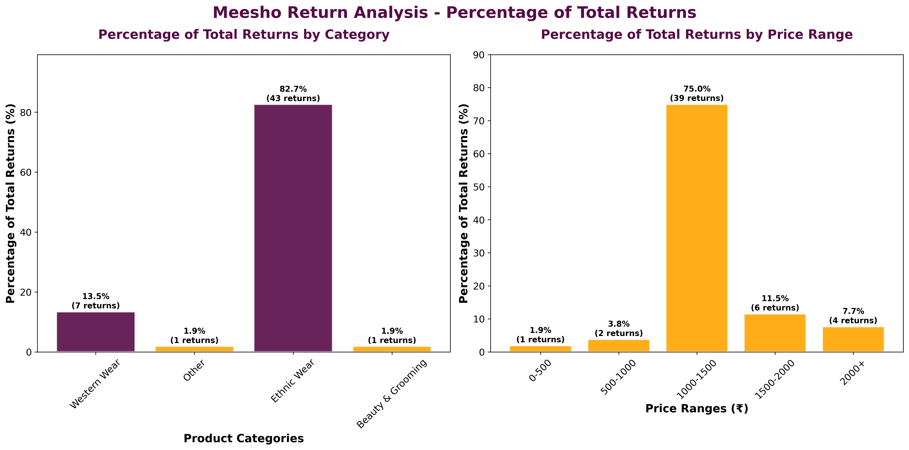
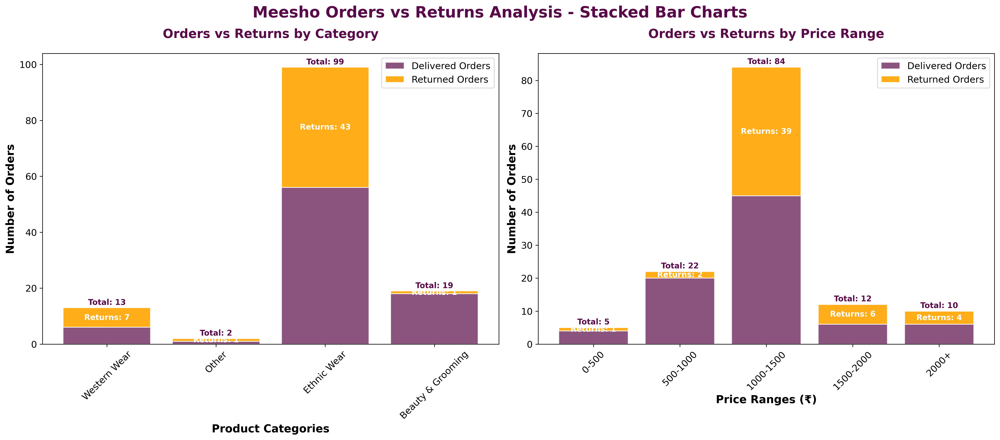

# Meesho Sales Data Analysis


Real data analysis of Meesho sales with NLP product categorization and return rate analysis. This project analyzes 133 merged records from Meesho's sales data to understand return patterns, product performance, and business insights.

##  Quick Start

```bash
# Activate environment
venv\Scripts\activate

# Run main analysis
python real_data_analysis.py

# Run return percentage analysis
python return_percentage_plots.py

# Run stacked bar analysis
python stacked_bar_analysis.py
```

##  How to Run

### **Prerequisites**
- Python 3.8+ installed
- Virtual environment activated

### **Step 1: Setup Environment**
```bash
# Navigate to project directory
cd d:\meesho

# Activate virtual environment
venv\Scripts\activate

# Install dependencies (if not already installed)
pip install -r requirements.txt
```

### **Step 2: Run Analysis Scripts**

#### **Main Analysis (Complete)**
```bash
python real_data_analysis.py
```
**Output:**
- `meesho_analysis_results.xlsx` - Excel report with 4 sheets
- `real_meesho_data_analysis.png` - Main dashboard
- Console output with detailed statistics

#### **Return Percentage Analysis**
```bash
python return_percentage_plots.py
```
**Output:**
- `return_percentage_analysis.png` - Return percentage charts
- Console output with return analysis

#### **Stacked Bar Analysis**
```bash
python stacked_bar_analysis.py
```
**Output:**
- `stacked_bar_analysis.png` - Stacked bar charts
- `return_percentage_analysis.png` - Percentage analysis
- Console output with detailed breakdown

### **Step 3: View Results**
- **Excel File:** Open `meesho_analysis_results.xlsx` for comprehensive data
- **Charts:** View PNG files for visualizations
- **Console:** Check terminal for detailed statistics and insights

### **Expected Runtime**
- Main analysis: ~30-60 seconds
- Return percentage: ~10-20 seconds  
- Stacked bar analysis: ~15-30 seconds

##  Project Structure

```
Meesho_Product_Analysis/
├── real_data_analysis.py              
├── return_percentage_plots.py         
├── stacked_bar_analysis.py            
├── README.md                          
├── requirements.txt                   
├── meesho ForwardReports.csv          
├── meesho Orders Aug.csv              
├── meesho_analysis_results.xlsx       
├── real_meesho_data_analysis.png
├── return_percentage_analysis.png      
└── stacked_bar_analysis.png           
```

##  Analysis Results


### **Return Percentage Analysis**

- **Percentage of Total Returns:** Shows what % of all returns each category represents
- **Return Distribution:** Clear visualization of return patterns
- **Business Insights:** Identify high-return categories and price ranges

### **Stacked Bar Analysis**

- **Orders vs Returns:** Visual comparison of total orders vs returns
- **Category Breakdown:** Stacked bars showing delivered vs returned orders
- **Price Range Analysis:** Return patterns across different price segments

##  Technical Features

### **Data Processing**
- **Data Merging:** 
- **NLP Categorization:** 
- **Return Analysis:** 

### **NLP Product Categorization**
- **6 Categories:** Ethnic Wear, Western Wear, Beauty & Grooming, Accessories, Home & Living, Electronics
- **100+ Keywords:** Advanced keyword matching for accurate classification
- **Smart Classification:** Products assigned to categories with highest match scores

### **Visualizations**
- **Stacked Bar Charts:** Total orders vs returns with clear visual separation
- **Return Percentage Charts:** % of total returns by category/price range
- **Meesho Branding:** Professional styling with brand colors (#580b48 purple, #FFA500 yellow)
- **Clean Design:** No grid lines, professional appearance

### **Excel Output (4 Sheets)**
- **Category_Analysis:** Return rates and percentages by product category
- **Price_Range_Analysis:** Return analysis by price ranges
- **Summary:** Overall statistics and metrics
- **Product_Categories:** All products with their assigned categories

##  Key Insights Generated

- **Return Rate Analysis:** Which categories have highest return rates
- **Price Range Patterns:** Return patterns across different price segments
- **Percentage Distribution:** What % of total returns each category represents
- **Product Performance:** Category-wise order and return statistics
- **Business Intelligence:** Actionable insights for business decisions

##  Dependencies

```
pandas >= 1.5.0
matplotlib >= 3.5.0
seaborn >= 0.11.0
plotly >= 5.0.0
openpyxl >= 3.0.0
```

##  Technical Workflow

1. **Data Loading & Merging** - CSV files → 133 merged records with 19 columns
2. **Data Preprocessing** - Clean product names, create return flags, handle missing values
3. **NLP Categorization** - Apply keyword matching across 6 product categories
4. **Statistical Analysis** - Calculate return rates, percentages, and distributions
5. **Visualization & Export** - Generate professional charts and comprehensive Excel report

##  Output Files

- **Excel Report:** `meesho_analysis_results.xlsx` (4 comprehensive sheets)
- **Main Dashboard:** `real_meesho_data_analysis.png` (category and price range analysis)
- **Return Analysis:** `return_percentage_analysis.png` (return percentage charts)
- **Stacked Charts:** `stacked_bar_analysis.png` (orders vs returns visualization)
- **Console Output:** Detailed statistics and business insights


